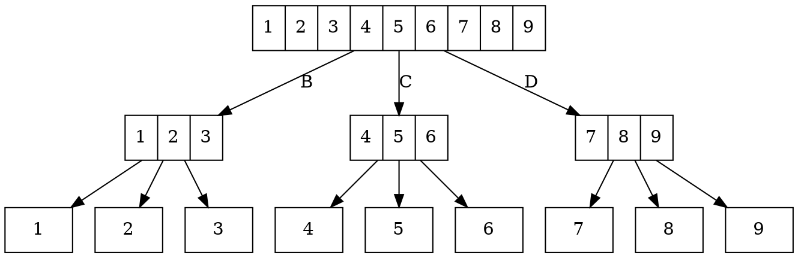

## Introduction

Each year there is a lot of confusion regarding time complexity of the `extend` operation on the lists in Python. I will introduce two specific examples from previous year and also will try to explain it on one of the possible implementations of `extend` operation.

## Technicalities

At the beginning we should clear some of the „myths“ regarding extending of the lists. There is a common misunderstanding regarding differences between `a += b`, `a.extend(b)` and `a + b`.

- `a.extend(b)` - adds all elements from `b` to `a`.

  Time complexity: $\mathcal{O}(n)$, where $n$ denotes the length of `b`.

- `a += b` - equivalent to `a.extend(b)`

- `a + b` - constructs a new list that contains elements from `a` followed by
  elements from `b`.

  Time complexity: $\mathcal{O}(m + n)$, where $m, n$ denote the length of
  `a` and `b` respectively.

  Space complexity: $\mathcal{O}(m + n)$, where $m, n$ denote the length of
  `a` and `b` respectively, since we construct new list.

## Example #1

Let us assume function that uses divide & conquer strategy to return indices at which we can find specific element in any list.

```py showLineNumbers
def recursive_find_in_list(
    values: List[Any], key: Any, lower: int, upper: int
) -> List[int]:
    if lower == upper:
        return [lower] if values[lower] == key else []

    indices = []
    mid = (lower + upper) // 2

    indices.extend(recursive_find_in_list(values, key, lower, mid))
    indices.extend(recursive_find_in_list(values, key, mid + 1, upper))

    return indices


def find_in_list(values: List[Any], key: Any) -> List[int]:
    return recursive_find_in_list(values, key, 0, len(values) - 1)
```

This implementation works nicely, `extend` is linear (with the respect to the length of the list that is being appended).

Let us try to dissect the way this function works on some specific input (that will be pushed to the extreme, _just in case_ ;)

`find_in_list([1] * 5000, 1)`. What shall be the result of this? Since we have `key = 1` and the list contains only `1`s, we should get list of **all** indices.

If we were to draw a tree of call hierarchy of `recursive_find_in_list`, we would notice that in sum it is still linear to the length. **However we use `extend`!**

In the leaves of the tree we return lists of length 1. In this case it means calling `extend` 5000-times at the second-to-last level of the tree on the 1-element long lists, next level 2500 calls on 2-elements long lists, next one 1250 on 4-elements long lists, etc. At the top-level we get 2 calls on 5000/2-element long lists.

A lot of `extend` calls, right? And the lengths of the lists are growing (in this example, second call happens on 2500-elements long lists).

Because of the `extend` in each level of the tree (call hierarchy) we traverse all of the elements. That means:

$$
\mathcal{O}(n \cdot \log n)
$$

because we have $\log n$ levels in the tree and $n$ elements at each level.

## Example #2

As we could observe in the example above, `extend` iterates over all of the elements that it adds. In case of recursive calls, it results in iterating over the same elements multiple times.

Consider constructing of this list:


<details>
<summary>Source for the rendered construction of the list</summary>



</details>

Let us assume that you extend the result with the list that you get from the recursive call.

- B iterates through 1, 2 and 3; returns `[1, 2, 3]`
- C iterates through 4, 5 and 6; returns `[4, 5, 6]`
- D iterates through 7, 8 and 9; returns `[7, 8, 9]`
- now we return those lists to the calls from A), so each of the `extend` calls iterates through:

  - 1, 2, 3 that was returned from B
  - 4, 5, 6 that was returned from C
  - 7, 8, 9 that was returned from D

  and returns `[1, 2, 3, 4, 5, 6, 7, 8, 9]`

If the recursion had bigger depth and/or more elements, it would iterate through them more than twice, therefore it does not take constant time to do nor some constant multiple of the input, since it traverses all of the elements in each of the levels.

## Implementation of `extend`

There is an example of dynamic array:

- [interface (`dynlist.h`)](pathname:///files/ib002/extend/dynlist.h)
- [implementation (`dynlist.c`)](pathname:///files/ib002/extend/dynlist.c)

For the sake of _Algorithms and Data Structures I_ we consider `APPEND` operation, i.e. adding the element to the end of the list, to have time complexity $\mathcal{O}(1)$ (**amortized**; which is out of the scope of IB002).

If we have a look at the `extend` implementation in this dynamic array example:

```c showLineNumbers
void dynamic_array_extend(struct dynamic_array_t *arr, struct dynamic_array_t *src)
{
    if (arr == NULL || src == NULL)
    {
        return;
    }

    for (size_t i = 0; i < src->count; i++)
    {
        dynamic_array_push_back(arr, dynamic_array_at(src, i));
    }
}
```

Apart from checking edge cases, we can notice that we run `for`-loop over the elements from the other array and add them one-by-one to the `arr`. Time complexity of this operation is time dependant on the `src` array.

In this specific implementation, you could also resize the memory allocated for the array in one go and copy _whole_ `src` array in one go. However even if you did so, it would be still dependant on the size of the `src` array. Cause you still need to copy $\texttt{count}(src) \cdot \texttt{elementSize}(src)$ bytes. From that we can assume that for specific instance of array the $\texttt{elementSize}(src)$ is fixed, therefore we consider it a constant. That way we are getting $\mathcal{O}(\texttt{count}(src))$ as a time complexity of our `extend` operation.
